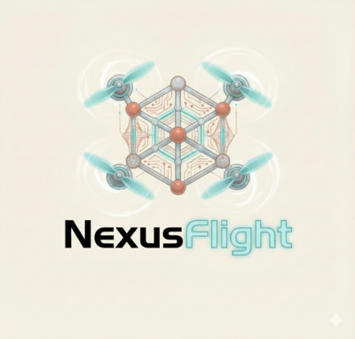

<p align="center">
  
</p>

<h1 align="center">NexusFlight Suite</h1>

<p align="center">
  <strong>The first flight controller ecosystem with integrated Field-Oriented Control ESC firmware — written entirely in Rust</strong>
</p>

<p align="center">
  <a href="https://github.com/AutomataNexus/NexusFlight-Suite/releases"></a>
  &nbsp;
  <a href="https://github.com/AutomataNexus/NexusFlight-Suite/releases"></a>
  &nbsp;
  <a href="https://github.com/AutomataNexus/NexusFlight-Suite/blob/main/LICENSE"></a>
</p>

<p align="center">
  <a href="https://NexusFlight.AutomataNexus.com"></a>
  &nbsp;
  
  &nbsp;
  
  &nbsp;
  
  &nbsp;
  <a href="#request-source-access"></a>
</p>

<p align="center">
  
  &nbsp;
  
  &nbsp;
  
  &nbsp;
  
  &nbsp;
  
</p>

<br/>

<p align="center">
  <a href="#-coredrive--field-oriented-control">FOC ESC</a> &nbsp;&bull;&nbsp;
  <a href="#downloads">Downloads</a> &nbsp;&bull;&nbsp;
  <a href="#nexusflight-firmware">Firmware</a> &nbsp;&bull;&nbsp;
  <a href="#nexusground-configurator">Configurator</a> &nbsp;&bull;&nbsp;
  <a href="#nexuscore-library">Core Library</a> &nbsp;&bull;&nbsp;
  <a href="docs/GETTING_STARTED.md">Getting Started</a> &nbsp;&bull;&nbsp;
  <a href="docs/SUPPORTED_HARDWARE.md">Hardware</a> &nbsp;&bull;&nbsp;
  <a href="https://NexusFlight.AutomataNexus.com">Website</a>
</p>

---

## Why NexusFlight?

Every existing flight controller firmware — Betaflight, iNav, ArduPilot — treats the ESC as a black box. You flash the FC firmware, you flash the ESC firmware, and you hope they play nice together. The FC sends throttle commands over DShot and that's where its control ends.

**NexusFlight breaks that wall down.**

NexusFlight Suite is the first and only flight controller ecosystem that ships **integrated FOC (Field-Oriented Control) ESC firmware** alongside the FC firmware — both written in Rust, both configured from the same app, both designed to work as one system. The flight controller doesn't just send throttle percentages; it understands the motor model, tunes the FOC loop, and reads real-time telemetry from every phase of motor commutation.

No other flight controller software does this.

---

## CoreDrive — Field-Oriented Control

<p align="center">
  
</p>

**CoreDrive** is a from-scratch BLDC motor ESC firmware with a full **Field-Oriented Control** engine. While traditional ESC firmware (BLHeli_32, BLHeli_S, AM32) uses trapezoidal six-step commutation, CoreDrive implements true **sinusoidal FOC** — the same control strategy used in industrial servo drives and high-performance robotics.

### What FOC Means for FPV

| | Traditional Six-Step | CoreDrive FOC |
|---|---|---|
| **Commutation** | 6 discrete steps per electrical revolution | Continuous sinusoidal — infinite resolution |
| **Torque ripple** | High — causes vibration and noise | Near-zero — smoother motor, cleaner gyro signal |
| **Efficiency** | ~85% typical | ~92-95% — less heat, longer flight times |
| **Low-throttle control** | Coarse, jittery | Precise and linear — better authority on micro quads |
| **Noise** | Audible commutation whine | Near-silent operation |
| **Startup** | Can stutter or desync | Controlled align → ramp with stall recovery |

### How It Works

CoreDrive decomposes motor current into two orthogonal axes using the **Park and Clarke transforms**:

- **D-axis (Direct)** — Controls magnetic flux. Held at zero for maximum torque-per-amp efficiency.
- **Q-axis (Quadrature)** — Controls torque. This is where your throttle command goes.

Each axis has its own **PI controller** with independently tunable Kp/Ki gains. A **sensorless back-EMF observer** estimates rotor position in real time — no hall sensors or encoders needed, just the three motor wires you already have.

### FOC Features

- **D-Q axis PI controllers** — Independent Kp/Ki gains for flux (D) and torque (Q) control
- **Motor model parameters** — Configure winding resistance, inductance, and observer gain for your specific motor
- **Sensorless rotor estimation** — Back-EMF observer tracks rotor position without hall sensors or encoders
- **Switchable control modes** — Toggle between FOC and Six-Step per ESC from NexusGround, fly on either
- **Configurable startup sequence** — Listen duration, alignment hold, eRPM ramp rate, stall recovery with cooldown
- **Full protection suite** — Over-current (mA), over-temperature, under-voltage (mV), commutation desync, stall timeout
- **3D / bidirectional mode** — Smooth FOC control in both motor directions for inverted flight
- **PWM flexibility** — 24, 48, or 96 kHz switching frequency with 0-30° timing advance
- **Extended DShot Telemetry** — eRPM, ESC temperature, current draw, and voltage per motor in real time
- **4-way passthrough** — Configure each ESC individually through the FC, no direct ESC connection needed
- **Integrated tuning** — Tune FOC parameters from NexusGround's ESC/CoreDrive tab with live motor detection

### FOC + NexusFlight = Tighter Loop

Because the FC and ESC firmware are designed together:

- The FC reads motor eRPM via bidirectional DShot and feeds it directly into **RPM-based dynamic notch filters** — eliminating motor vibration harmonics from the gyro signal before they reach the PID loop
- Motor model parameters (resistance, inductance, pole pairs) are shared between the FOC observer and the FC's telemetry system
- Configuration backup captures both FC and ESC settings to Aegis-DB in one operation
- One configurator app (NexusGround) tunes both the flight PID loop and the motor FOC loop

---

## Downloads

### NexusGround (Configurator)

The desktop app for configuring your flight controller and ESCs — PID tuning, FOC tuning, rates, receiver setup, OSD, VTX, blackbox, firmware flashing, and more.

| Platform | Download | Size |
|----------|----------|------|
| **Windows 10/11** (x64) | [NexusGround_0.1.0_x64-setup.exe](https://github.com/AutomataNexus/NexusFlight-Suite/releases/download/nexusground-v0.1.0/NexusGround_0.1.0_x64-setup.exe) | ~19 MB |
| **Linux** (.deb — Ubuntu/Debian) | [NexusGround_0.1.0_amd64.deb](https://github.com/AutomataNexus/NexusFlight-Suite/releases/download/nexusground-v0.1.0/NexusGround_0.1.0_amd64.deb) | ~20 MB |
| **Linux** (.rpm — Fedora/RHEL) | [NexusGround-0.1.0-1.x86_64.rpm](https://github.com/AutomataNexus/NexusFlight-Suite/releases/download/nexusground-v0.1.0/NexusGround-0.1.0-1.x86_64.rpm) | ~20 MB |
| **Linux** (.AppImage — Universal) | [NexusGround_0.1.0_amd64.AppImage](https://github.com/AutomataNexus/NexusFlight-Suite/releases/download/nexusground-v0.1.0/NexusGround_0.1.0_amd64.AppImage) | ~88 MB |

> **Note:** macOS builds are coming soon. For now, macOS users can build from source — see [Building from Source](docs/BUILDING.md).

### NexusFlight (Firmware)

Pre-built firmware binaries for supported flight controllers. Flash directly via NexusGround's built-in firmware flasher.

| Board Family | MCU | Download |
|-------------|-----|----------|
| STM32F405 boards | STM32F405RGT6 | [nexusflight-stm32f405.bin](https://github.com/AutomataNexus/NexusFlight-Suite/releases/download/nexusflight-v0.1.0/nexusflight-stm32f405.bin) |
| STM32F411 boards | STM32F411CEU6 | [nexusflight-stm32f411.bin](https://github.com/AutomataNexus/NexusFlight-Suite/releases/download/nexusflight-v0.1.0/nexusflight-stm32f411.bin) |
| STM32F722 boards | STM32F722RET6 | [nexusflight-stm32f722.bin](https://github.com/AutomataNexus/NexusFlight-Suite/releases/download/nexusflight-v0.1.0/nexusflight-stm32f722.bin) |

> **Full board list:** See [Supported Hardware](docs/SUPPORTED_HARDWARE.md) for all 27 supported boards.

### NexusCore (Library)

The core flight algorithms as a standalone Rust crate — `no_std` compatible, usable in your own projects.

```toml
# Cargo.toml — available upon source access request
[dependencies]
nexus-core = { git = "https://github.com/AutomataNexus/NexusFlight.git", branch = "main" }
```

| Asset | Download |
|-------|----------|
| Source documentation | [API Reference](https://github.com/AutomataNexus/NexusFlight-Suite/releases/download/nexuscore-v0.1.0/nexus-core-docs.tar.gz) |

---

## The Suite

### NexusFlight Firmware

- **Pure Rust** — No C dependencies, memory-safe by default
- **Embassy async runtime** — Cooperative multitasking with zero-cost abstractions
- **Advanced PID controller** — Feed-forward, I-term relax, anti-gravity, TPA
- **Sensor fusion** — Complementary AHRS with configurable filter chains (PT1, PT2, Biquad, Notch, Dynamic Notch with FFT)
- **Protocol support** — MSP v2, CRSF/ELRS, S.BUS, DShot (150/300/600), SmartAudio, Tramp IRC
- **Bidirectional DShot** — Real-time eRPM telemetry via GCR decoding, RPM-driven dynamic notch filters
- **OSD** — MAX7456 DisplayPort with configurable element layout
- **GPS** — u-blox UBX binary protocol with GPS Rescue failsafe
- **Blackbox** — Onboard dataflash logging with delta compression
- **Safety** — Arming checks, failsafe, launch control, turtle mode (flip-over-after-crash)

### NexusGround Configurator

- **14 configuration tabs** — Setup, Firmware, PID, Rates, Receiver, Motors, Gyro/Filters, OSD, VTX, GPS, Blackbox, CLI, ESC/CoreDrive
- **ESC/CoreDrive FOC tab** — Per-motor detection, D/Q-axis PID tuning sliders, motor model parameters (resistance, inductance, observer gain), protection thresholds, startup sequence editor — all in one panel
- **Built-in firmware flasher** — Build from source or flash pre-built .bin via AN3155 bootloader protocol
- **Config backup** — Automatic FC + ESC configuration backup to Aegis-DB before flashing
- **Cross-platform** — Windows and Linux (macOS coming soon)
- **Modern UI** — Dark/light theme, real-time data display
- **Built with Tauri 2** — Native performance, small footprint

### NexusCore Library

- **`no_std` compatible** — Runs on bare metal, WASM, or desktop
- **490+ unit tests** — Comprehensive test coverage
- **Modular** — Use only the algorithms you need (PID, AHRS, filters, RC, MSP, etc.)
- **Benchmarked** — Performance-critical paths benchmarked with Criterion

---

## Supported Hardware

NexusFlight supports **27 flight controller boards** across multiple MCU families:

| MCU Family | Boards | Status |
|------------|--------|--------|
| **STM32F405** | Matek F405-SE, SpeedyBee F405 V3/V4, iFlight SucceX-E F4, and more | Stable |
| **STM32F411** | SpeedyBee F405 Mini, BetaFPV F4 1S 12A AIO, and more | Stable |
| **STM32F722** | Matek F722-SE, SpeedyBee F7 V3, JHEMCU GF30F722-AIO, and more | Stable |
| **STM32F745** | Matek F765-WSE | Beta |
| **STM32H743** | SpeedyBee F405 V4, Matek H743-SLIM | Beta |
| **AT32F435** | iFlight Blitz F4 F435 | Beta |

> See [docs/SUPPORTED_HARDWARE.md](docs/SUPPORTED_HARDWARE.md) for the full board list with pinouts and features.

---

## Quick Start

### 1. Install NexusGround

Download the installer for your platform from the [Releases](https://github.com/AutomataNexus/NexusFlight-Suite/releases) page, or use the direct links above.

### 2. Connect Your Flight Controller

Plug in your FC via USB. NexusGround will auto-detect the board, MCU, and current firmware version.

### 3. Flash NexusFlight Firmware

Use the **Firmware** tab in NexusGround:
1. Select your board (auto-detected or manual)
2. Click **Build from Source** or browse a pre-built `.bin`
3. Click **Backup Config & Prepare Flash**
4. Enter bootloader mode (hold BOOT + plug USB)
5. Click **Detect & Flash**

### 4. Configure Everything — FC and ESC — in One Place

Use the configurator tabs to tune PIDs, set rates, configure your receiver, OSD, VTX, and then open the **ESC/CoreDrive** tab to tune your FOC parameters, set protection thresholds, and configure motor startup — all without leaving the app.

> See [docs/GETTING_STARTED.md](docs/GETTING_STARTED.md) for a detailed walkthrough.

---

## Architecture

```
NexusFlight Suite
│
├── NexusFlight (FC Firmware)
│   ├── nexus-core ........... Flight algorithms (PID, AHRS, filters, MSP, GPS, OSD, VTX)
│   ├── nexus-hal ............ Hardware abstraction (SPI, I2C, UART, DMA, ADC, timers)
│   ├── nexus-drivers ........ Device drivers (BMI270, ICM-42688, MAX7456, CRSF, DShot)
│   ├── nexus-board .......... Board definitions and pin mappings (27 boards)
│   └── targets/ ............. MCU-specific entry points (STM32F4, STM32F7, SITL)
│
├── CoreDrive (FOC ESC Firmware)          ← No other FC suite has this
│   ├── coredrive-core ....... FOC engine, D-Q PI controllers, six-step, motor model,
│   │                          sensorless observer, startup sequence, protection systems
│   └── coredrive-passthrough  4-way interface for per-ESC configuration via FC
│
├── NexusGround (Configurator)
│   ├── src/ ................. React + TypeScript frontend (14 tabs incl. FOC tuning)
│   ├── src-tauri/ ........... Rust backend (MSP bridge, serial, flasher, ESC passthrough)
│   └── e2e/ ................. 150 automated tests across 3 layers
│
└── Aegis-DB ................. Configuration database (FC + ESC backup/restore/profiles)
```

---

## Request Source Access

The NexusFlight source code is maintained in private repositories. We welcome contributors, hardware partners, and community members who want to get involved.

**To request access:**

1. Visit [NexusFlight.AutomataNexus.com](https://NexusFlight.AutomataNexus.com) and reach out via the contact form
2. Email us at **devops@automatanexus.com** with:
   - Your GitHub username
   - What you'd like to contribute (firmware, FOC/ESC, drivers, ground station, docs, testing)
   - Your experience with flight controllers, motor control, or embedded Rust
3. Open an [Issue](https://github.com/AutomataNexus/NexusFlight-Suite/issues/new?template=source-access.md) in this repo using the "Source Access Request" template

We typically respond within 48 hours.

---

## Community

- **Website:** [NexusFlight.AutomataNexus.com](https://NexusFlight.AutomataNexus.com)
- **Email:** devops@automatanexus.com
- **Issues & Requests:** [GitHub Issues](https://github.com/AutomataNexus/NexusFlight-Suite/issues)

---

## License

NexusFlight Suite is licensed under the **GNU General Public License v3.0**. See [LICENSE](LICENSE) for details.

Commercial licensing is available — contact us at [NexusFlight.AutomataNexus.com](https://NexusFlight.AutomataNexus.com).

---

<p align="center">
  <strong>Built with Rust. Built for flight. The only FC suite with integrated FOC.</strong><br/><br/>
  <a href="https://NexusFlight.AutomataNexus.com">NexusFlight.AutomataNexus.com</a>
</p>
